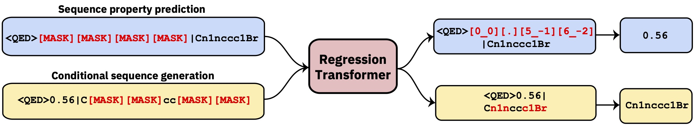

# Regression Transformer
[](https://opensource.org/licenses/MIT)

A multitask Transformer that reformulates regression as a conditional sequence modeling task.
This yields a dichotomous language model that seamlessly integrates regression with property-driven conditional generation.



This repo contains the development code.

## Demo with UI
🤗 A gradio demo with a simple UI is available at: https://huggingface.co/spaces/jannisborn/regression_transformer


## Building upon this research

#### You want to use a pretrained RT-model or finetune it on your own data? Then read here, otherwise the development setup can be found [below](#development-setup).

The Regression Transformer is implemented in the [GT4SD](https://github.com/GT4SD/gt4sd-core) library.
Via GT4SD, using several pretrained RegressionTransformers is a matter of a few lines of code :rocket:.
A complete tutorial of running inference, finetuning a RT model (or training it from scratch) and sharing and deploying it to the GT4SD model hub, can be found [here](https://github.com/GT4SD/gt4sd-core/tree/main/examples/regression_transformer).

For example, via GT4SD you can use the RT pretrained on small molecules with some properties as shown in the paper, in particular [QED](https://www.nature.com/articles/nchem.1243) and [ESOL](https://pubs.acs.org/doi/10.1021/ci034243x) (water solubility). There is also several multiproperty variants of the RT: e.g., a model trained jointly on logP and synthesizability (aka [SCScore](https://pubs.acs.org/doi/10.1021/acs.jcim.7b00622)).
For protein language modeling, you will also find a RT trained on a [peptide stability](https://www.science.org/doi/full/10.1126/science.aan0693) dataset from the [TAPE](https://github.com/songlab-cal/tape) benchmark.

A jupyter notebook with a toy usecase on adapting a molecule toward solubility is provided in [GT4SD](https://github.com/GT4SD/gt4sd-core/blob/main/notebooks/regression-transformer-demo.ipynb) too.
If you use [GT4SD](https://github.com/GT4SD/gt4sd-core), you can generate molecules like this:
```python
from gt4sd.algorithms.conditional_generation.regression_transformer import (
    RegressionTransformer, RegressionTransformerMolecules
)

buturon = "CC(C#C)N(C)C(=O)NC1=CC=C(Cl)C=C1"
target_esol = -3.53 
config = RegressionTransformerMolecules(
    algorithm_version="solubility",
    search="sample",
    temperature=2, 
    tolerance=5,
    sampling_wrapper={
        'property_goal': {'<esol>': target_esol}, 
        'fraction_to_mask': 0.2
    }
)
esol_generator = RegressionTransformer(configuration=config, target=buturon)
generations = list(esol_generator.sample(8))
```

Explore the solubility of the local chemical space around Buturon. Upon varying the property primers, you might obtain something like this:


## Development setup
This is mainly intended to reproduce or extend the results of the paper.
```console
conda env create -f conda.yml
conda activate terminator
pip install -e .
```

### Data
The processed data used to train the models is available via [Box](https://ibm.box.com/s/kijawq3rf4191bbcyflsxx7kp9m74jnx).

### Training a model
You can download the data and launch a training by pointing to train and test data:
```console
python scripts/run_language_modeling.py --output_dir rt_example \
    --config_name configs/rt_small.json --tokenizer_name ./vocabs/smallmolecules.txt \
    --do_train --do_eval --learning_rate 1e-4 --num_train_epochs 5 --save_total_limit 2 \
    --save_steps 500 --per_gpu_train_batch_size 16 --evaluate_during_training --eval_steps 5 \
    --eval_data_file ./examples/qed_property_example.txt --train_data_file ./examples/qed_property_example.txt \
    --line_by_line --block_size 510 --seed 42 --logging_steps 100 --eval_accumulation_steps 2 \
    --training_config_path training_configs/qed_alternated_cc.json
```
:warning: This configuration uses dummy data, do not use as is :no_good:
The `training_config_path` argument points to a file that specifies the training regime. This is optional, if the argument is not given, we default to vanilla PLM training that masks everywhere with equal probability (recommended for initial pretraining only). For refined examples, please see `training_configs` folder.

Also note that the `vocabs` folder contains the vocabulary files for training on small molecules, proteins and chemical reactions.

Exemplary model configurations (number of heads, layers, etc.) can be found in the [configs](./configs) folder.

:warning: **XLNet trains relatively slowly. It is recommended to start a training/finetuning from a pretrained model, ideally with the GT4SD trainer** (see above) :warning:


### Evaluating a model
To evaluate a model trained e.g., on the QED task, run the following:
```console
python scripts/eval_language_modeling.py --output_dir path_to_model \
--eval_file ./examples/qed_property_example.txt --eval_accumulation_steps 2 --param_path configs/qed_eval.json
```

### Pretrained models
Pretrained models are available via the GT4SD model hub. There's a total of 9 models that can also be used via [HuggingFace Spaces](https://huggingface.co/spaces/jannisborn/regression_transformer). Models that are part of the publication are also available via the [Box folder mentioned above](https://ibm.box.com/s/kijawq3rf4191bbcyflsxx7kp9m74jnx). 

#### Generate some data
To generate custom data for the QED task in a RT-compatible format, run [scripts/generate_example_data.py](./scripts/generate_example_data.py) and point to a `.smi` file with SMILES in the first column.
```console
python scripts/generate_example_data.py examples/example.smi examples/qed_property_example.txt
```
For user-defined properties, please adapt the file or open an issue.

If you need to create a new vocabulary for a dataset you can use [scripts/create_vocabulary.py](./scripts/create_vocabulary.py) it will also automatically add some special tokens at the top of your vocabulary file.
```console
python scripts/create_vocabulary.py examples/qed_property_example.txt examples/vocab.txt
```

At this point the folder containing the vocabulary file can be used to load a tokenizer compatible with any `ExpressionBertTokenizer`:
```python
>>> from terminator.tokenization import ExpressionBertTokenizer
>>> tokenizer = ExpressionBertTokenizer.from_pretrained('examples')
>>> text = '<qed>0.3936|CBr'
>>> tokens = tokenizer.tokenize(text)
>>> print(tokens)
['<qed>', '_0_0_', '_._', '_3_-1_', '_9_-2_', '_3_-3_', '_6_-4_', '|', 'C', 'Br']
>>> token_indexes = tokenizer.convert_tokens_to_ids(tokenizer.tokenize(text))
>>> print(token_indexes)
[16, 17, 18, 28, 45, 34, 35, 19, 15, 63]
>>> tokenizer.build_inputs_with_special_tokens(token_indexes)
[12, 16, 17, 18, 28, 45, 34, 35, 19, 15, 63, 13]
```

## Citation
If you use the regression transformer, please cite:
```bib
@article{born2022regression,
  title={Regression Transformer: Concurrent Conditional Generation and Regression by Blending Numerical and Textual Tokens},
  author={Born, Jannis and Manica, Matteo},
  journal={arXiv preprint arXiv:2202.01338},
  note={Spotlight talk at ICLR workshop on Machine Learning for Drug Discovery},
  year={2022}
}
```
